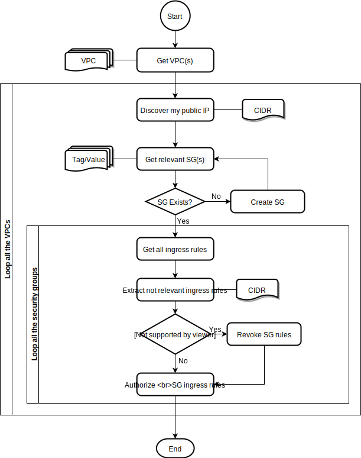

[TOC]

---

### Overview

### This tool has a purpose that gives you to access to some AWS EC2 resources such as EC2 instance by creating and updating the public facing your IP address in the specific security group easily.


---

### How it works

When you run this tool, it will create a security group in a designated VPC or default VPC if it does not exist and to add your public facing IP address such the NAT IP of your broadband network, to the security group to allow network access from your location.

At the moment, it uses the specific tags to manage security group to manage network access control.

| Key        | Value         |
| ---------- | ------------- |
| Purpose    | AccessControl |
| AllowsFrom | HomeRouterIP  |

By default, it only allows some ports, but you can specify more with one or more `--port` options when running it. 

- `TCP/22` for `SSH` communication
- `TCP/80` for `HTTP` communication
- `TCP/443` for `HTTPS` communication
- `TCP/3389` for `RDP` communication
- `TCP/8443` for `WAS` related communication

Please have a look at the content below, it shows you how to do it if you want.


#### Internal workflow




---

### How to use it

This tool is very simple because its purpose is very simple, but it will give you some hints on how to use it.

#### Help

```bash
$ ./ControlSG.py -h
usage: ControlSG.py [-h] [--cidr CIDR] [--region REGION] [--vpc-id VPC_ID] [--port PORT] [--log-file LOG_FILE] [--log-level {DEBUG,INFO,WARNING,ERROR,CRITICAL}] [--show-vpcs-only]
                    [--verbose] [--version]

Control My IP Security Group

options:
  -h, --help            show this help message and exit
  --cidr CIDR           CIDR block to be set explicitly (default: None)
  --region REGION       Set region to make API calls (default: None)
  --vpc-id VPC_ID       Set VPC ID to update. (default: None)
  --port PORT           Add port to allow. Allowing Syntax: TCP/1234, TCP/20000-30000, UDP/123 (default: None)
  --log-file LOG_FILE   specifying the log file (default: application.log)
  --log-level {DEBUG,INFO,WARNING,ERROR,CRITICAL}
                        specifying the log file (default: INFO)
  --show-vpcs-only      Display the VPC list (default: False)
  --verbose, -v         Show verbosive output message (default: 0)
  --version             show program's version number and exit

You can freely modify or distribute this script to anyone
```


#### Check VPC existence

```bash
$ ./ControlSG.py --show-vpcs
Num          VPC ID                  VPC Name                CIDR Block
=== ======================== ======================== ========================
  0       vpc-5bd53722               Default               172.31.0.0/16
=== ======================== ======================== ========================

$ ./ControlSG.py --show-vpcs --region us-west-2
Num          VPC ID                  VPC Name                CIDR Block
=== ======================== ======================== ========================
  0  vpc-026422be0846ecc6f           Default               172.31.0.0/16
  1  vpc-0a70c4c09689cb2c9         DevConLabVPC             10.3.0.0/16
=== ======================== ======================== ========================
```


#### Update my public IP address

```bash
$ ./ControlSG.py
Discovered my public IP address - 37.123.123.123/32
Getting relevant VPC security groups by tags
Updating the security group - sg-085697a96e040f0b5
Authorized TCP/22 incoming from 37.123.123.123/32
Authorized TCP/80 incoming from 37.123.123.123/32
Authorized TCP/443 incoming from 37.123.123.123/32
Authorized TCP/3389 incoming from 37.123.123.123/32
Authorized TCP/8443 incoming from 37.123.123.123/32
```

> The tool will obtain your public IP address and automatically update the security group.

```bash
./ControlSG.py --cidr 123.123.123.123/32
CIDR is configured explicitly - 123.123.123.123/32
Getting relevant VPC security groups by tags
Updating the security group - sg-085697a96e040f0b5
Authorized TCP/22 incoming from 123.123.123.123/32
Authorized TCP/80 incoming from 123.123.123.123/32
Authorized TCP/443 incoming from 123.123.123.123/32
Authorized TCP/3389 incoming from 123.123.123.123/32
Authorized TCP/8443 incoming from 123.123.123.123/32
```

> You can specify a specific IP address instead of auto discovery.


#### Allowing more ports than the default

```bash
./ControlSG.py --port 'TCP/3000-3999' --port 'UDP/123'
Discovered my public IP address - 37.123.123.123/32
Getting relevant VPC security groups by tags
Updating the security group - sg-085697a96e040f0b5
Authorized TCP/22 incoming from 37.123.123.123/32
Authorized TCP/80 incoming from 37.123.123.123/32
Authorized TCP/443 incoming from 37.123.123.123/32
Authorized TCP/3389 incoming from 37.123.123.123/32
Authorized TCP/8443 incoming from 37.123.123.123/32
Authorized TCP/3000-3999 incoming from 37.123.123.123/32
Authorized UDP/123 incoming from 37.123.123.123/32
```


#### Debug

```bash
$ ./ControlSG.py --log-level DEBUG
Run Options - Namespace(cidr=None, region=None, vpc_id=None, port=None, log_file='application.log', log_level='DEBUG', show_vpcs_only=False, verbose=0)
Retrieved VPC(s) - [{'CidrBlock': '172.31.0.0/16', 'DhcpOptionsId': 'dopt-2dd5884b', 'State': 'available', 'VpcId': 'vpc-5bd53722', 'OwnerId': '************', 'InstanceTenancy': 'default', 'CidrBlockAssociationSet': [{'AssociationId': 'vpc-cidr-assoc-710c061a', 'CidrBlock': '172.31.0.0/16', 'CidrBlockState': {'State': 'associated'}}], 'IsDefault': True}]
All VPCs are the target for updating relevant security groups
Discovered my public IP address - 37.123.123.123/32
Getting relevant VPC security groups by tags
Search tags - [{'Name': 'vpc-id', 'Values': ['vpc-5bd53722']}, {'Name': 'tag:Purpose', 'Values': ['AccessControl']}, {'Name': 'tag:AllowsFrom', 'Values': ['HomeRouterIP']}]
Cleaning up ingress rule IDs - ['sgr-085f2ef7c487e1c7d', 'sgr-0864b0f545ab8f520', 'sgr-09fe42ea3e7a9fc33', 'sgr-0e242cc15a3036b18', 'sgr-07e9bcbb2d1a69301']
Updating the security group - sg-085697a96e040f0b5
Generated IpPermissions - [{'IpProtocol': 'tcp', 'FromPort': 22, 'ToPort': 22, 'IpRanges': [{'CidrIp': '37.123.123.123/32'}]}, {'IpProtocol': 'tcp', 'FromPort': 80, 'ToPort': 80, 'IpRanges': [{'CidrIp': '37.123.123.123/32'}]}, {'IpProtocol': 'tcp', 'FromPort': 443, 'ToPort': 443, 'IpRanges': [{'CidrIp': '37.123.123.123/32'}]}, {'IpProtocol': 'tcp', 'FromPort': 3389, 'ToPort': 3389, 'IpRanges': [{'CidrIp': '37.123.123.123/32'}]}, {'IpProtocol': 'tcp', 'FromPort': 8443, 'ToPort': 8443, 'IpRanges': [{'CidrIp': '37.123.123.123/32'}]}]
Authorized TCP/22 incoming from 37.123.123.123/32
Authorized TCP/80 incoming from 37.123.123.123/32
Authorized TCP/443 incoming from 37.123.123.123/32
Authorized TCP/3389 incoming from 37.123.123.123/32
Authorized TCP/8443 incoming from 37.123.123.123/32
```


```bash 
$ ./ControlSG.py --log-level DEBUG -vvv
2023-07-15 17:20:54,654 DEBUG MainProcess[40119] ControlSG:main(361) Run Options - Namespace(cidr=None, region=None, vpc_id=None, port=None, log_file='application.log', log_level='DEBUG', show_vpcs_only=False, verbose=3)
2023-07-15 17:20:54,925 DEBUG MainProcess[40119] ControlSG:get_vpcs(100) Retrieved VPC(s) - [{'CidrBlock': '172.31.0.0/16', 'DhcpOptionsId': 'dopt-2dd5884b', 'State': 'available', 'VpcId': 'vpc-5bd53722', 'OwnerId': '************', 'InstanceTenancy': 'default', 'CidrBlockAssociationSet': [{'AssociationId': 'vpc-cidr-assoc-710c061a', 'CidrBlock': '172.31.0.0/16', 'CidrBlockState': {'State': 'associated'}}], 'IsDefault': True}]
2023-07-15 17:20:54,925 DEBUG MainProcess[40119] ControlSG:main(397) All VPCs are the target for updating relevant security groups
2023-07-15 17:20:55,511 INFO MainProcess[40119] ControlSG:get_my_public_ip(244) Discovered my public IP address - 37.123.123.123/32
2023-07-15 17:20:55,511 INFO MainProcess[40119] ControlSG:get_relevant_vpc_security_groups(119) Getting relevant VPC security groups by tags
2023-07-15 17:20:55,511 DEBUG MainProcess[40119] ControlSG:get_relevant_vpc_security_groups(120) Search tags - [{'Name': 'vpc-id', 'Values': ['vpc-5bd53722']}, {'Name': 'tag:Purpose', 'Values': ['AccessControl']}, {'Name': 'tag:AllowsFrom', 'Values': ['HomeRouterIP']}]
2023-07-15 17:20:55,678 DEBUG MainProcess[40119] ControlSG:update_sg_ingress_rules(191) Cleaning up ingress rule IDs - ['sgr-0fbd34592dd102ccd', 'sgr-003152c58f4803306', 'sgr-0eb61c0308c4b8532', 'sgr-0710fe22c4c3df086', 'sgr-0eefd73ee3d1f7007']
2023-07-15 17:20:55,877 INFO MainProcess[40119] ControlSG:update_sg_ingress_rules(218) Updating the security group - sg-085697a96e040f0b5
2023-07-15 17:20:55,877 DEBUG MainProcess[40119] ControlSG:update_sg_ingress_rules(219) Generated IpPermissions - [{'IpProtocol': 'tcp', 'FromPort': 22, 'ToPort': 22, 'IpRanges': [{'CidrIp': '37.123.123.123/32'}]}, {'IpProtocol': 'tcp', 'FromPort': 80, 'ToPort': 80, 'IpRanges': [{'CidrIp': '37.123.123.123/32'}]}, {'IpProtocol': 'tcp', 'FromPort': 443, 'ToPort': 443, 'IpRanges': [{'CidrIp': '37.123.123.123/32'}]}, {'IpProtocol': 'tcp', 'FromPort': 3389, 'ToPort': 3389, 'IpRanges': [{'CidrIp': '37.123.123.123/32'}]}, {'IpProtocol': 'tcp', 'FromPort': 8443, 'ToPort': 8443, 'IpRanges': [{'CidrIp': '37.123.123.123/32'}]}]
2023-07-15 17:20:56,063 INFO MainProcess[40119] ControlSG:update_sg_ingress_rules(228) Authorized TCP/22 incoming from 37.123.123.123/32
2023-07-15 17:20:56,063 INFO MainProcess[40119] ControlSG:update_sg_ingress_rules(228) Authorized TCP/80 incoming from 37.123.123.123/32
2023-07-15 17:20:56,063 INFO MainProcess[40119] ControlSG:update_sg_ingress_rules(228) Authorized TCP/443 incoming from 37.123.123.123/32
2023-07-15 17:20:56,063 INFO MainProcess[40119] ControlSG:update_sg_ingress_rules(228) Authorized TCP/3389 incoming from 37.123.123.123/32
2023-07-15 17:20:56,063 INFO MainProcess[40119] ControlSG:update_sg_ingress_rules(228) Authorized TCP/8443 incoming from 37.123.123.123/32
```

> With `--log-level`and `-vvv`, the tool will give you more information about which code or function did most of the tasks.


#### Log file

This tool logs each task in `application.log` as it is executed. You can track it down by looking at it if you like.

```bash
$ tail -n 20 application.log
2023-07-15 17:20:46,000 DEBUG main: Run Options - Namespace(cidr='123.123.123.123/32', region=None, vpc_id=None, port=None, log_file='application.log', log_level='DEBUG', show_vpcs_only=False, verbose=0)
2023-07-15 17:20:46,686 DEBUG get_vpcs: Retrieved VPC(s) - [{'CidrBlock': '172.31.0.0/16', 'DhcpOptionsId': 'dopt-2dd5884b', 'State': 'available', 'VpcId': 'vpc-5bd53722', 'OwnerId': '************', 'InstanceTenancy': 'default', 'CidrBlockAssociationSet': [{'AssociationId': 'vpc-cidr-assoc-710c061a', 'CidrBlock': '172.31.0.0/16', 'CidrBlockState': {'State': 'associated'}}], 'IsDefault': True}]
2023-07-15 17:20:46,686 DEBUG main: All VPCs are the target for updating relevant security groups
2023-07-15 17:20:46,686 INFO main: CIDR is configured explicitly - 123.123.123.123/32
2023-07-15 17:20:46,686 INFO get_relevant_vpc_security_groups: Getting relevant VPC security groups by tags
2023-07-15 17:20:46,687 DEBUG get_relevant_vpc_security_groups: Search tags - [{'Name': 'vpc-id', 'Values': ['vpc-5bd53722']}, {'Name': 'tag:Purpose', 'Values': ['AccessControl']}, {'Name': 'tag:AllowsFrom', 'Values': ['HomeRouterIP']}]
2023-07-15 17:20:46,847 DEBUG update_sg_ingress_rules: Cleaning up ingress rule IDs - ['sgr-0d776af57ed9ac008', 'sgr-03c4321c5d320cc2e', 'sgr-049c46e0b9510cfca', 'sgr-012871109c393aa5b', 'sgr-0e5057121bd09713d']
2023-07-15 17:20:47,046 INFO update_sg_ingress_rules: Updating the security group - sg-085697a96e040f0b5
2023-07-15 17:20:47,046 DEBUG update_sg_ingress_rules: Generated IpPermissions - [{'IpProtocol': 'tcp', 'FromPort': 22, 'ToPort': 22, 'IpRanges': [{'CidrIp': '123.123.123.123/32'}]}, {'IpProtocol': 'tcp', 'FromPort': 80, 'ToPort': 80, 'IpRanges': [{'CidrIp': '123.123.123.123/32'}]}, {'IpProtocol': 'tcp', 'FromPort': 443, 'ToPort': 443, 'IpRanges': [{'CidrIp': '123.123.123.123/32'}]}, {'IpProtocol': 'tcp', 'FromPort': 3389, 'ToPort': 3389, 'IpRanges': [{'CidrIp': '123.123.123.123/32'}]}, {'IpProtocol': 'tcp', 'FromPort': 8443, 'ToPort': 8443, 'IpRanges': [{'CidrIp': '123.123.123.123/32'}]}]
2023-07-15 17:20:47,257 INFO update_sg_ingress_rules: Authorized TCP/22 incoming from 123.123.123.123/32
2023-07-15 17:20:47,257 INFO update_sg_ingress_rules: Authorized TCP/80 incoming from 123.123.123.123/32
2023-07-15 17:20:47,258 INFO update_sg_ingress_rules: Authorized TCP/443 incoming from 123.123.123.123/32
2023-07-15 17:20:47,258 INFO update_sg_ingress_rules: Authorized TCP/3389 incoming from 123.123.123.123/32
2023-07-15 17:20:47,258 INFO update_sg_ingress_rules: Authorized TCP/8443 incoming from 123.123.123.123/32
```

